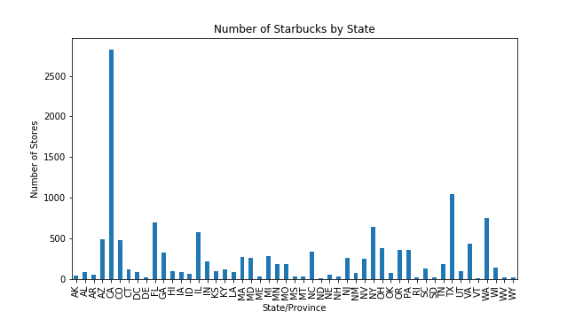
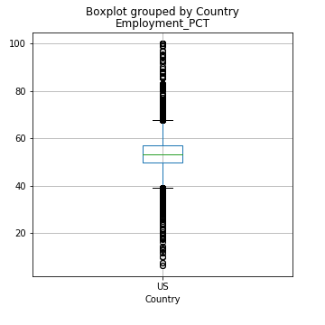
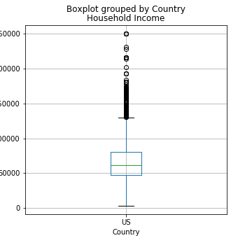
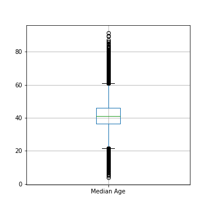
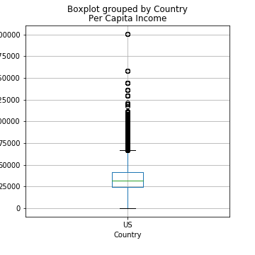
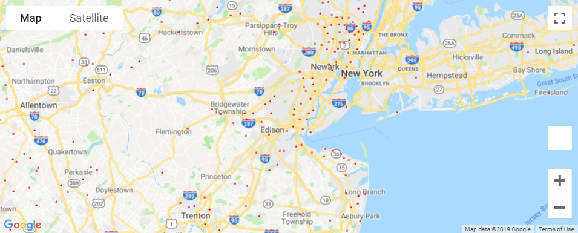
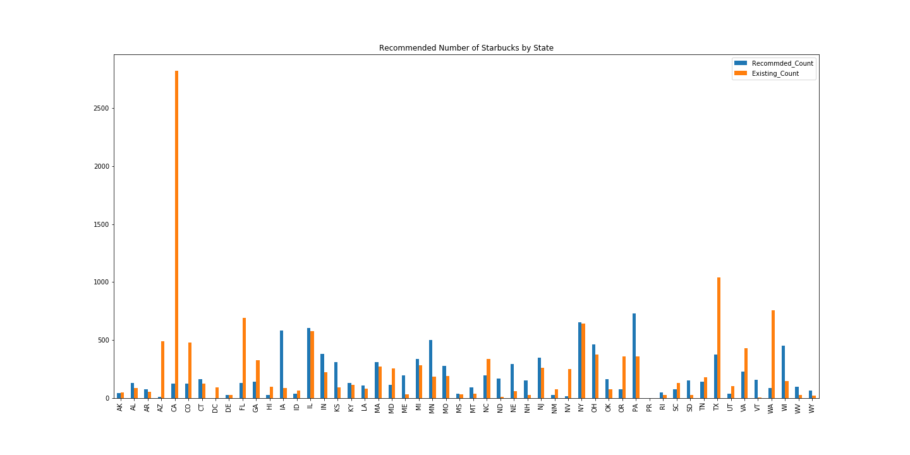

# Analysis - Are there opportunities for more Starbucks in the United States ?

## Background

Starbucks had an amazing growth in the past 30 years. 

However in the recent past same-store sales has slowed questioning if growth of Starbucks has started slowing down.

We are trting to find if Starbucks market is saturated or are there **opportunities** for more Starbucks in the United States?

## Sources

1. Starbucks file from kaggle
2. Census file
3. States in US and its centroid lat long
4. Zipcode sqllite database with distance from each

## Analysis - Today's spread

Starbucks is spread around metro cities. California has the highest number of stores, followed by Texas and Washington.

There are few cities with more than hundres starbucks. New York City has 240 stores, which is the highest.


```python


```


```python


```

### Plot the 4 key attributes - Household Income, Percapita Income, Employment Percetage, Median Age for existing Strabucks zips.


```python




```

The mean and Standard Deviation for these 4 attributes were compared with non starbucks location to arrive at recommendations.
If the value for all 4 attributes fall within 1 SD of the mean, the zipcode is recommended. 
All zipcodes and the demographics were obtained from Census file.

After profiling on the 4 attributes, 7,957 zip codes were recommended for opening Starbucks locations. 
These were checked for existing stores within 2 miles and finally 7,464 zip codes were recommended.


```python
#### Existing Starbucks were plotted for NY NJ area using Google Maps Api


```


```python
#### Recommendations were plotted for NY NJ area using Google Maps API 


```

It is evident from above that New York City area which has over 240 stores is not in the recommended list.


```python
#### Barchart for existing vs. recommended stores



It is evident that for states that already have a very high number of Starbucks, the recommendations are less.
```

### Independent t-test results

Null Hypothesis used was that the 4 attributes varies significantly between the zips that have Starbucks 
and that do not. After doing an independent t test, based on the p-value, the null hypothesis 
was not rejected. 
    Thus, we concluded that the 4 attributes used are statistically different between zip codes 
with and without Starbucks locations.

### Conclusion

Upon comparing Mean Age, Household Income, Percapita Income, Employment Percentage 
and not considering neighboring zips, there are around 7,464 zips that are recommended for future locations.


```python

```
